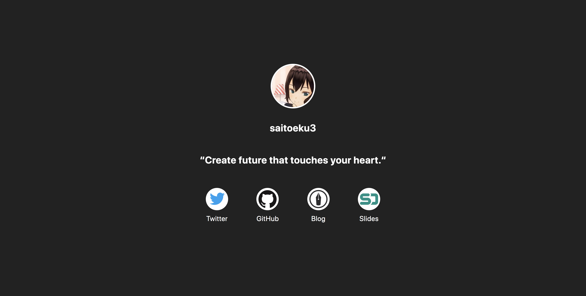

  <h1 align="center" style="margin: 0;">
    <a href="https://saitoeku3.dev">saitoeku3.dev</a>
  </h1>
  

    
    
  

   

  <a href="https://drive.google.com/file/d/1yWtEj0fRIZiUArMyCV_jQ-ZknH1JtF-S/view?usp=sharing">Download Design data (XD)</a>

